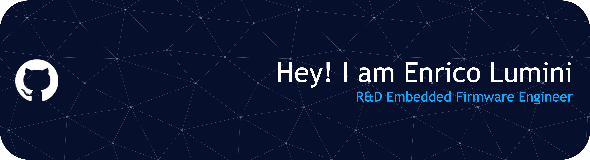

## 👋  Hey there! I'm Enrico Lumini

### 👨🏻‍💻  About Me

💼  R&D Embedded Firmware Engineer at [Blumotix](https://blumotix.it), Italy. \
💡  I enjoy low-level firmware development, with a focus on resource optimization in constrained environments. \
🌱  Currently exploring CAN bus communication, FreeRTOS, and real-time embedded systems with ESP32 and ESP-IDF. \
✍️  In my free time, I enjoy 3D printing, DIY electronics projects, and sim racing. \
📄  Feel free to reach out for collaboration or interesting discussions.

### 🛠  Tech Stack

**Languages**

 
 
 
 

**Embedded**

 
 
 
 
 
 

**Tools**

 
 
 
 
 
 

### ⚙️ GitHub Analytics

### 🤝🏻  Connect with Me

